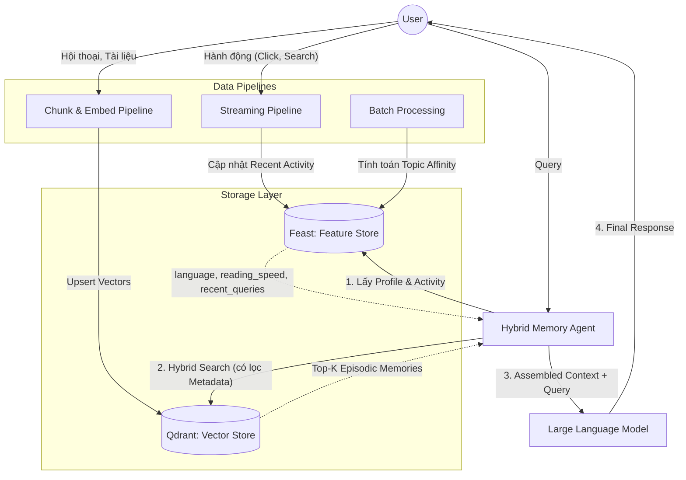

# Hệ thống Hybrid Memory cho Trợ lý cá nhân AI

Tài liệu này mô tả thiết kế kiến trúc của một hệ thống Hybrid Memory dành cho trợ lý AI cá nhân, kết hợp giữa Vector Store (cho bộ nhớ sự kiện) và Feature Store (cho hồ sơ người dùng ổn định).

## 1. Sơ đồ kiến trúc

## 2. Các quyết định kiến trúc cốt lõi và Tradeoffs

### 2.1. Chunking strategy (Chiến lược phân mảnh bộ nhớ)
- **Quyết định:** Sử dụng kết hợp **"Semantic break"** (cắt theo ngữ nghĩa/đoạn văn) cho tài liệu và **"Per-message"** (cắt theo từng tin nhắn) cho hội thoại, có áp dụng overlap ngắn.
- **Tradeoff (Retrieval quality vs Storage cost vs Context window):** 
  Thay vì gộp toàn bộ cuộc hội thoại vào một chunk lớn (giúp tiết kiệm *Storage cost* nhưng làm giảm *Retrieval quality* vì sinh ra nhiễu), hoặc cắt cứng theo số lượng token (làm gãy ngữ nghĩa), cách tiếp cận này giúp chất lượng tìm kiếm vector cực kỳ chuẩn xác. Điểm đánh đổi là *tốn kém chi phí lưu trữ hơn* (số lượng vector sinh ra nhiều hơn) và chiếm dụng lớn *Context window* của LLM nếu tìm về quá nhiều chunk nhỏ vụn. Do đó, cần kết hợp thêm Parent-Document Retrieval ở phía Agent để kiểm soát kích thước context.

### 2.2. Feature schema (Lược đồ đặc trưng cho User Profile)
- **Quyết định:** Mix giữa **Tabular features** (thuộc tính tường minh) và **Embedding features** (đặc điểm ẩn từ lịch sử).
- **Thiết kế Schema (Entity: `user_id`):**
  - `language_preference` (Tabular string) | Source: Explicit setting | TTL: Vô hạn.
  - `reading_speed` (Tabular float) | Source: Tính toán từ event tracker | TTL: Vô hạn.
  - `topic_affinity` (Embedding vector) | Source: Batch job phân tích history | TTL: 30 ngày.
  - `recent_queries` (List/Array) | Source: Streaming pipeline | TTL: 1 giờ.
- **Lý do chọn pattern:** Pattern Tabular xử lý cực nhanh các cấu hình cố định. Trong khi đó, với các sở thích khó diễn tả (latent preferences), dùng *Embedding features* sẽ giúp Agent dễ dàng thực hiện recommendation và semantic matching với nội dung mới, thay vì phải gắn các "tag" tĩnh cứng nhắc lên profile của user.

### 2.3. Freshness strategy (Chiến lược cập nhật độ mới)
- **Quyết định:** Áp dụng kiến trúc Lambda/Kappa phân tách độ trễ (latency) tuỳ thuộc vào loại bộ nhớ.
- **3 Use cases:**
  1. *Hoạt động gần đây (Streaming Push API):* **Sub-second**. Nếu user vừa hỏi "Kubernetes là gì?", hệ thống phải cập nhật ngay vào `recent_queries` để duy trì ngữ cảnh cho câu hỏi bám sát ngay sau đó.
  2. *Lưu tài liệu/Bộ nhớ sự kiện (Episodic Memory):* **5-min Batch (hoặc Near-realtime Async)**. Khi user vừa đọc xong một tài liệu, việc chunking và embedding tốn nhiều chi phí I/O, do đó sẽ đưa vào Queue (Kafka/RabbitMQ) để xử lý và hiển thị trong vòng 5 phút (trừ phi người dùng force reload).
  3. *Cập nhật hồ sơ sở thích (Topic Affinity):* **Daily Batch**. Sở thích cốt lõi của user không thay đổi xoành xoạch từng phút. Chạy pipeline cập nhật mỗi đêm giúp tiết kiệm chi phí compute khổng lồ so với việc cập nhật realtime sau mỗi cú click.

## 3. Lựa chọn kiến trúc bị loại bỏ
- **Lựa chọn từng xem xét:** *Lưu trữ Episodic memory dưới dạng Embedding Feature View trong Feature Store (Feast) thay vì dùng thêm một Vector Store (Qdrant) chuyên biệt, hoặc ngược lại, nhét toàn bộ user profile vào Metadata Payload của Qdrant.*
- **Lý do loại bỏ:** Tôi loại bỏ hướng gộp chung này vì **Re-index cycle (chu kỳ tái tạo dữ liệu) khác biệt hoàn toàn**. Episodic memory là dạng dữ liệu *Append-only* (chỉ thêm mới liên tục mỗi khi có tin nhắn/tài liệu mới). Trong khi đó, User Profile (như `reading_speed`, `recent_queries`) lại là dạng dữ liệu *Overwrite* (cập nhật đè liên tục theo thời gian thực). Nếu nhét profile vào Payload của Vector Store, ta sẽ phải liên tục gọi lệnh Update Point trên các vector cũ, gây phân mảnh ổ đĩa và suy giảm hiệu năng tìm kiếm của CSDL Vector. Phân tách rõ Feast và Qdrant là cách duy nhất để tối ưu I/O cho cả hai loại tải.

## 4. Đặc thù cho môi trường Việt Nam (Vietnamese-context considerations)
- **Vấn đề Tokenization & Phonetic Typo (Gõ không dấu):** Tiếng Việt là ngôn ngữ đơn âm tiết. User thường hay gõ lỗi không dấu (ví dụ: "tai lieu" thay vì "tài liệu"). Tokenizer mặc định của các mô hình LLM quốc tế thường cắt sai từ ghép, làm mất trắng ngữ nghĩa khi tra cứu bằng BM25 (Hybrid Search).
  - *Giải pháp:* Ở nhánh Sparse Search (từ khóa), sử dụng NLP chuyên dụng cho tiếng Việt (như `pyvi` hoặc `underthesea`) để Word Segmentation trước khi index. Đồng thời cấu hình Analyzer chuẩn hóa bỏ dấu (unaccent) cho kho lưu trữ từ khoá để hỗ trợ gõ không dấu.
- **Vấn đề Code-switching (Mix Anh - Việt):** Người dùng, đặc biệt là nhóm IT/Tech, rất hay trộn ngôn ngữ (ví dụ: "Deploy cho anh cái cluster k8s này, dạo này hay bị OOM"). 
  - *Giải pháp:* Sử dụng mô hình Embedding đa ngữ (Multilingual - như `BGE-m3` hoặc `paraphrase-multilingual-MiniLM-L12-v2`) để đảm bảo không bị lệch không gian vector khi dịch nghĩa ngầm định. Đồng thời, System Prompt của Agent phải được hướng dẫn cứng việc *không cố gắng dịch thuật ngữ chuyên ngành sang tiếng Việt* khi trả lời, nhằm giữ độ tự nhiên trong văn phong.
